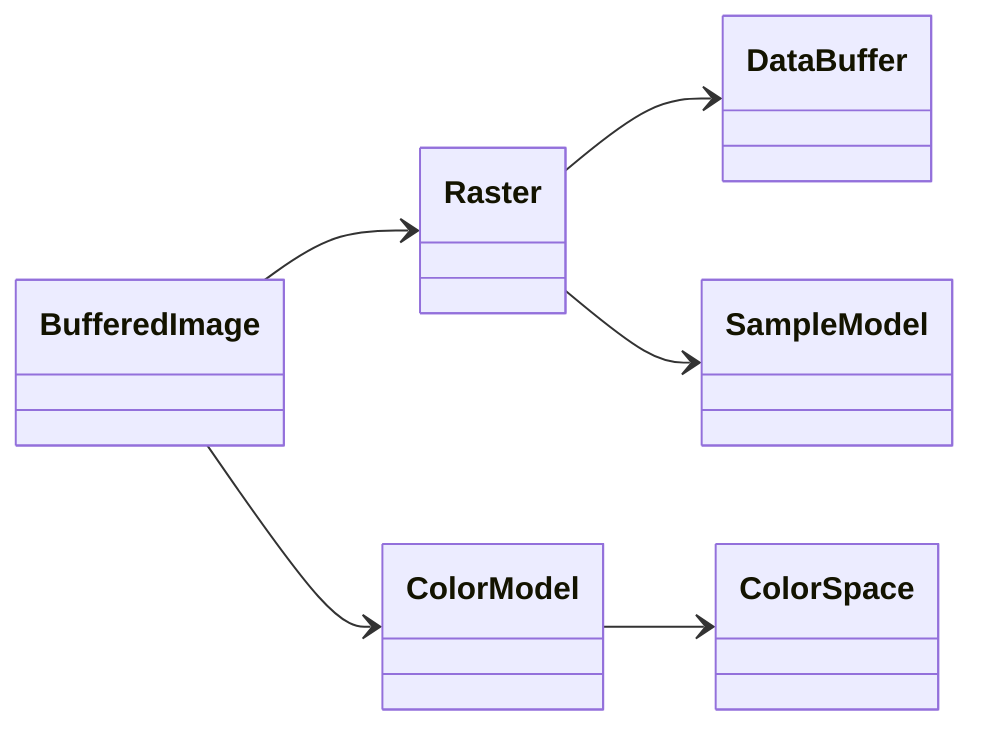
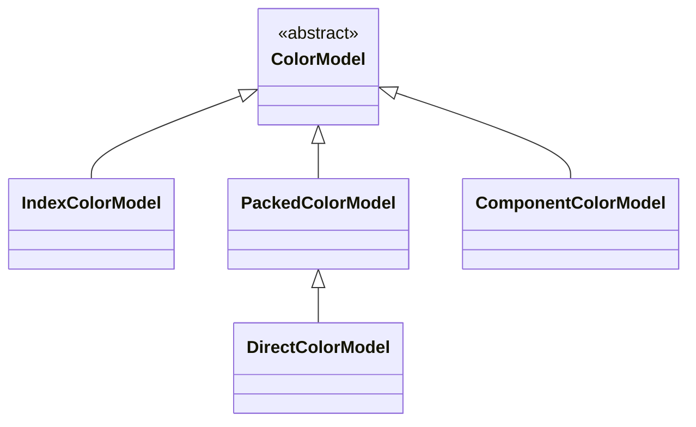
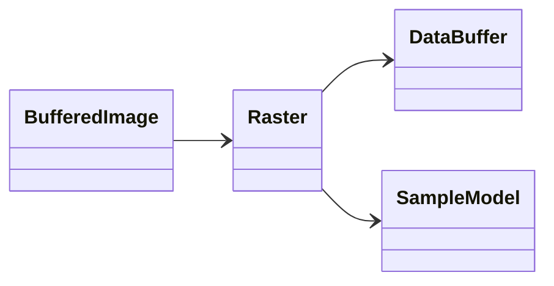
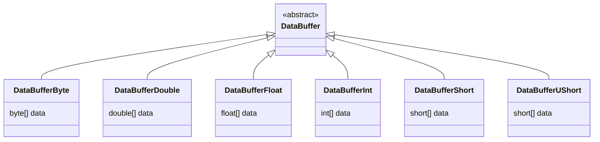
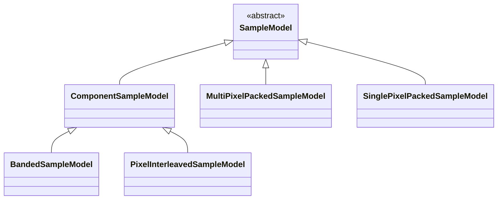
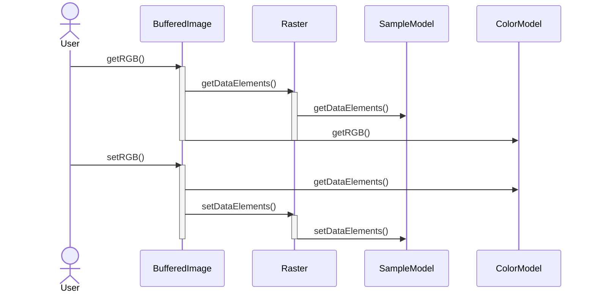
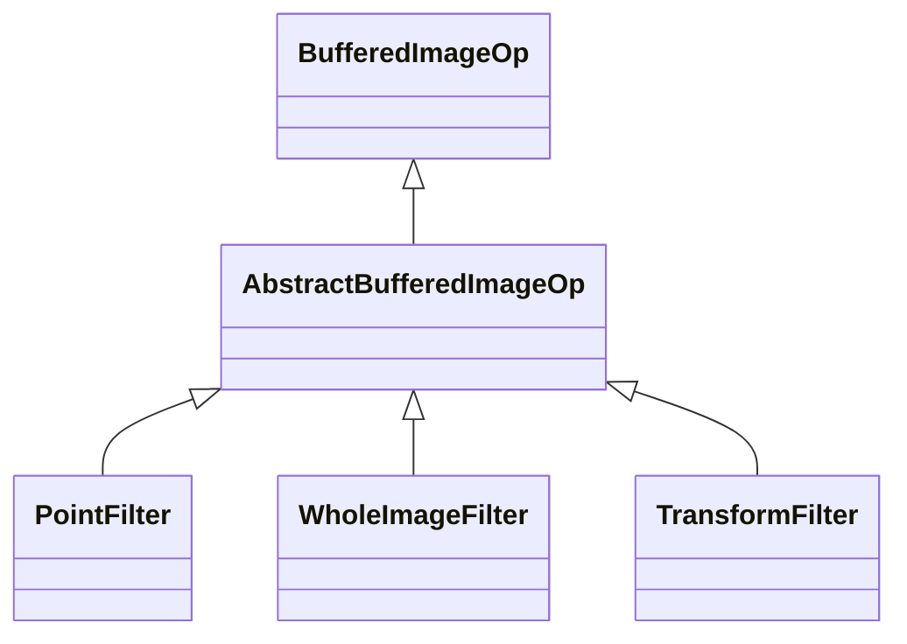

# Developer Guide

This work-in-progress document contains information that could be useful for Pixelitor contributors.

# Understanding Buffered Images

There are many good online tutorials for Swing and for the Java 2D API, but there isn't much about the internals of BufferedImage, therefore I wrote the following overview.

A [```BufferedImage```](https://docs.oracle.com/en/java/javase/17/docs/api/java.desktop/java/awt/image/BufferedImage.html) consists of a [```Raster```](https://docs.oracle.com/en/java/javase/17/docs/api/java.desktop/java/awt/image/Raster.html) and a [```ColorModel```](https://docs.oracle.com/en/java/javase/17/docs/api/java.desktop/java/awt/image/ColorModel.html).   
The ```Raster``` contains the samples (pixel values), and the ```ColorModel``` knows how to interpret the samples as colors (more exactly ```ColorModel``` interprets the samples as color components, and its [```ColorSpace```](https://docs.oracle.com/en/java/javase/17/docs/api/java.desktop/java/awt/color/ColorSpace.html) interprets the color components as actual colors).



## Color Models

The color model can tell the color of a pixel. The pixel values in a ```Raster``` are not necessarily colors, [indexed-color](https://en.wikipedia.org/wiki/Indexed_color) images (using the [```IndexColorModel```](https://docs.oracle.com/en/java/javase/17/docs/api/java.desktop/java/awt/image/IndexColorModel.html)) store the colors in a palette, and the raster only contains indexes referring to this palette.



[```PackedColorModel```](https://docs.oracle.com/en/java/javase/17/docs/api/java.desktop/java/awt/image/PackedColorModel.html) means that the colors are packed inside the pixel values. "Packed" always means that multiple values are packed into a larger Java primitive, and they can be retrieved by bit-shifting. For example four 8-bit values could be packed in a single 32-bit int in ARGB order, and they could be retrieved like this:

```java
    int packed = ...
    int alpha = (packed >>> 24) & 0xFF;
    int red = (packed >>> 16) & 0xFF;
    int green = (packed >>> 8) & 0xFF;
    int blue = packed & 0xFF;
```

```PackedColorModel``` has a subclass specialized for RGB, called [```DirectColorModel```](https://docs.oracle.com/en/java/javase/17/docs/api/java.desktop/java/awt/image/DirectColorModel.html).

[```ComponentColorModel```](https://docs.oracle.com/en/java/javase/17/docs/api/java.desktop/java/awt/image/ComponentColorModel.html) means that the colors are not indexed, but also not packed, there is a 1:1 correspondence between the color components and array elements. This works with ```ComponentSampleModel``` (see bellow).

## Rasters

A ```Raster``` contains the pixel data. It consists of
a [```DataBuffer```](https://docs.oracle.com/en/java/javase/17/docs/api/java.desktop/java/awt/image/DataBuffer.html) (a wrapper around raw pixel arrays)
and a [```SampleModel```](https://docs.oracle.com/en/java/javase/17/docs/api/java.desktop/java/awt/image/SampleModel.html) (which knows how to get pixel values from the raw arrays).



The WritableRaster subclass has methods for modifying the pixel data.


### Data Buffers



A ```DataBuffer``` stores the image data at the lowest level, as Java arrays. For example [```DataBufferInt```](https://docs.oracle.com/en/java/javase/17/docs/api/java.desktop/java/awt/image/DataBufferInt.html) stores the data in int arrays.

A ```DataBuffer```contains one or more *banks*. The banks don't have to be different arrays, each bank can be part of the same array. Banks should not to be confused with *bands* - a band is a group of pixel samples of the same kind, usually it corresponds to a color channel, for example all the red values within an RGB image. 


A *data element* is one entry in a bank/array. A ```DataBuffer``` can set the individual data elements in its banks. 

### Sample Models



Each pixel consists of a number of [samples](https://en.wikipedia.org/wiki/Sample_(graphics)), which (together with the color model and its color space) will determine the color of the pixels. For example the R, G, B values can be the samples of an RGB pixel, C, M, Y, K can be the sample of an CMKY pixel. In the case of indexed-color images, a sample is just an integer index in the palette. Sample Models are "color blind", the same sample model could be used for CMKY and for ARGB images, the color interpretation is done by the color models.

The subclasses of ```SampleModel``` know how to get pixel samples from a data buffer's array(s). Sample models convert raw Java arrays to pixel data, which may or may not be the same as the color data (depending on the color model).

A common sample model is [```SinglePixelPackedSampleModel```](https://docs.oracle.com/en/java/javase/17/docs/api/java.desktop/java/awt/image/SinglePixelPackedSampleModel.html), which packs all samples of a pixel into a single array element. ```SinglePixelPackedSampleModel``` works well with ```PackedColorModel```.

[```MultiPixelPackedSampleModel```](https://docs.oracle.com/en/java/javase/17/docs/api/java.desktop/java/awt/image/MultiPixelPackedSampleModel.html) can be used for single channel images, where multiple pixels are packed in a single array element, for example four 8-bit grayscale pixels are packed into a 32-bit Java int.

A [```ComponentSampleModel```](https://docs.oracle.com/en/java/javase/17/docs/api/java.desktop/java/awt/image/ComponentSampleModel.html) stores pixel samples in separate data elements in the banks/arrays. The [```BandedSampleModel```](https://docs.oracle.com/en/java/javase/17/docs/api/java.desktop/java/awt/image/BandedSampleModel.html) subclass stores different pixels samples in separate data banks, for example an array could contain all the red values, then all the green values, and finally the blue values (3 different banks in the same array): [R, R, R, ..., G, G, G, ..., B, B, B...]. The [```PixelInterleavedSampleModel```](https://docs.oracle.com/en/java/javase/17/docs/api/java.desktop/java/awt/image/PixelInterleavedSampleModel.html) subclass stores the pixels interleaved in a single array, like for example [R, G, B, R, G, B, ...]. 

```ComponentSampleModel``` works well with ```ComponentColorModel```.

## The Rules of the Game

Different ```ColorModel```, ```SampleModel``` and ```DataBuffer``` subclasses can't be combined in an arbitrary way, because the combinations must be compatible. For example ```ColorModel``` has methods for creating compatible sample models and rasters.

```BufferedImage``` has ```getRGB``` and ```setRGB``` methods that hide all this complexity, but they are slow (if you want to access and modify millions of pixels). Changing the raw array(s) behind ```BufferedImage``` is much faster, but then we must understand the meaning of the array elements.

The following image illustrates how the seemingly simple getRGB() and setRGB() calls can trigger some complex computations. Calling getRGB() and setRGB() for each pixel of an image will run much slower than necessary.              



## Exercises

1. Try to read a gif or indexed png file, it should give you an image with ```IndexColorModel```, and then try to modify its palette in a small project. Also examine the type of the raster and the sample model. As a first step, you could simply print the palette's colors. When you have an ```IndexColorModel```, you can get the palette colors with ```getBlues(byte[] b)``` and similar methods. The array size is given by ```getMapSize()```. You can't just change the color model of a buffered image, you'll have to construct a new one, with the new indexed color model and the old raster.
2. Read a small jpg image, and print the contents of the actual Java array behind the resulting buffered image.

# Understanding ```BufferedImageOp``` and the JH Labs filters

There are two ways to change a buffered image. You can call ```createGraphics()``` on it to create a [```Graphics2D```](https://docs.oracle.com/en/java/javase/17/docs/api/java.desktop/java/awt/Graphics2D.html). This allows you to draw on the image, but what you draw will not depend on the existing pixels values. If you do this, don't forget to call ```dispose()``` on the Graphics2D object when you are done.

The more powerful way to change a buffered image is  [```BufferedImageOp```](https://docs.oracle.com/en/java/javase/17/docs/api/java.desktop/java/awt/image/BufferedImageOp.html), which can create a new image based on the existing pixels. Most filters in Pixelitor either use the [JH Labs filters](http://www.jhlabs.com/ip/filters/) directly or extend its base classes. Note that Pixelitor uses an improved version of the original JH Labs filters, with added multithreading, progress tracking, bugfixes, and other improvements.

The ```BufferedImageOp``` implementations in the JDK are not very useful for Pixelitor, but ```com.jhlabs.image.AbstractBufferedImageOp``` is a good base class for image filters. ```org.jdesktop.swingx.image.AbstractFilter``` is a similar idea, but its subclasses are less powerful. The most important subclasses of ```AbstractBufferedImageOp``` are the following:

1. ```PointFilter```. A superclass for point filters. A point filter means that the output pixel depends on the input pixel and the input pixel's position, but NOT on the value of other pixels.
2. ```WholeImageFilter```. A superclass for filters which need to have the whole image in memory. The output pixel values can depend on any input pixel value.
3. ```TransformFilter```. A superclass for distorting and displacing filters. These don't change the pixel colors, but move them to different places. Subclasses must implement the ```transformInverse``` method, which returns the position in the input image, given the position in the output image. The idea is to move through all the pixel positions in the output, and for each point to determine the input position, inverting our normal thinking. Since the source position will be typically *between* two input pixels, interpolation will be needed. If the source position is outside the image, then the "edge action" determines what should happen. 



