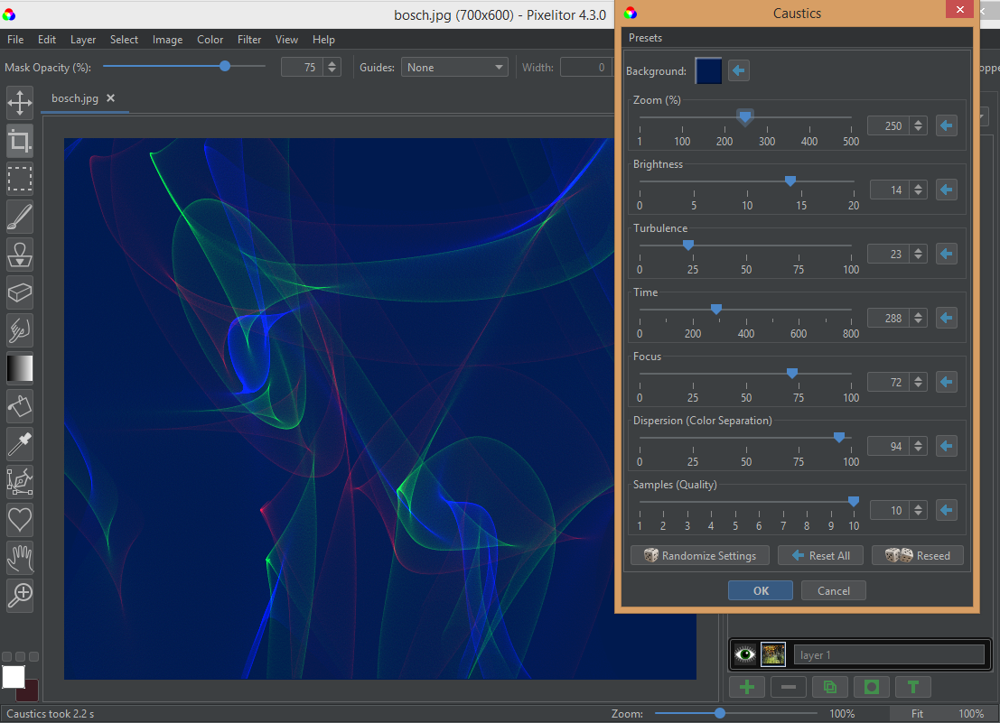

# Pixelitor Roadmap

The purpose of this document is to outline possible major future changes to Pixelitor. It's incomplete, a work in progress. You can ask questions or give feedback in the [Discord server](https://discord.gg/SXaxYnBSTv).

## Non-destructive editing

- A smart object should be able to have more than one smart filter.
- Smart filters should be able to have their own layer masks.
- Adjustment layers should be implemented.
- A shape layer should be able to contain more than one shape.
- At the moment, there are very few shapes to choose from, and they are encoded in the PXC files in a way that limits future extensibility. The PXC-encoding of the shapes should be changed to allow extending it to multiple shapes.

## Using C/C++ libraries

A lot of open-source code for image processing exists only as C/C++ libraries. To access C++ libraries, it may be worth using the [Foreign Function & Memory API](https://openjdk.java.net/jeps/424),  even though it will still be in Preview state in Java 19.
Some libraries we could use:
- [ImageMagick](https://imagemagick.org/) - this is already used for import/export, but only through the command line, which is slower than necessary because all images are encoded in PNG before sending them to ImageMagick.
- [G'MIC](https://gmic.eu/) - it has hundreds of image filters, and an embedded interpreter for creating new filters.
- [GEGL](https://gegl.org/) - many of Gimp's filters are implemented here.

## PXC format changes

PXC is the format that can save all Pixelitor features. The current format is based on Java serialization. This was easy to implement, but it has the some disadvantages:

- Some parts of the code are difficult to change in a way that keeps them compatible.
- It would be very difficult to import pxc files into non-Java programs.

It's possible to change the format of the saved files while still being able to read the old PXC files. There could be a version that can read both formats and can convert the old files to the new format.
One option is to make the new format an extension of [OpenRaster](https://www.openraster.org/). This would mean that many other image editors could at least partially read the new PXC files.

## Macros and logs

Recording and replaying macros would allow automating repetitive tasks.

Logging would make it easier to report errors. Ideally, logging would be in the form of automatically replayable macros.

## Flat Theme

The [Flat Look and Feel](https://github.com/JFormDesigner/FlatLaf) could be a theme option. This is how Pixelitor would look with it:

## Seeds in presets

Currently, the filter presets don't save the seed(s) used for the different types of randomness, and therefore the image can look different after applying a preset. 
This is a problem especially when using smart filters, because they also contain filter presets under the hood.
      
## Multiline and styled text

It would be nice if text layers could use multiple lines of text, and even better if each character could be styled individually. The first can be achieved by using a [JTextArea](https://docs.oracle.com/en/java/javase/17/docs/api/java.desktop/javax/swing/JTextArea.html), and the second by using a [JTextPane](https://docs.oracle.com/en/java/javase/17/docs/api/java.desktop/javax/swing/JTextPane.html).

